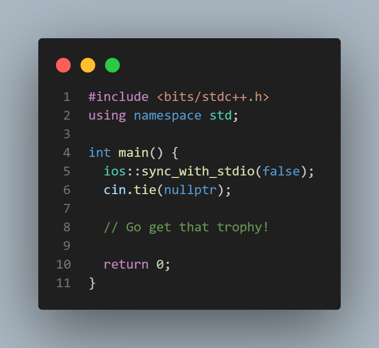

# C++ Competitive Programming Boilerplate

Forget the trivialities and focus on the solution 🏆!

## Description

This snippet is a bare-bones C++ boilerplate meant for competitive programming.  
The code takes inspiration from *Jinagly*'s, *Tourist*'s, and other high ranking competitive programmer's submissions.  
  
More features will be added in the future.  

## Usage

1. Find and install "cpp-cp-boilerplate" from VSCode Marketplace or the extensions tab
2. Type `cpb` or `cpbt`
3. Hit enter
4. Code!

## Contribute
  
Contributions are welcome!  
